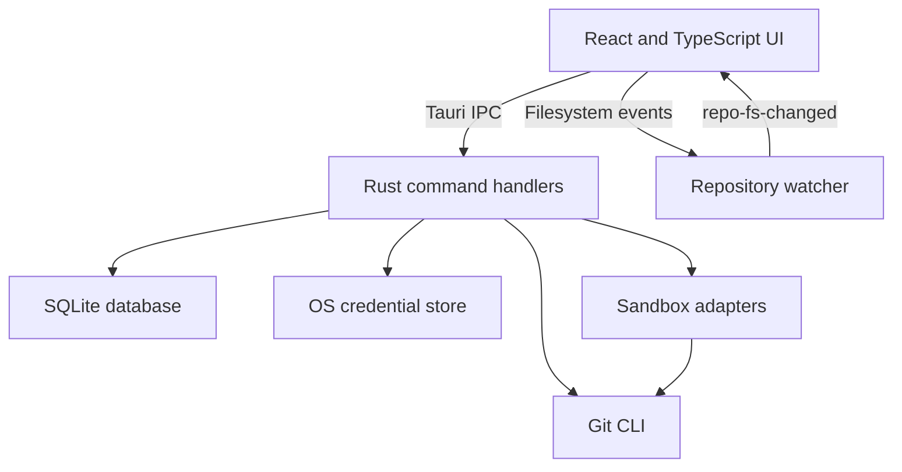

<div align="center">

  

  # Stage0

  [](./LICENSE)
  [](https://tauri.app/)
  [](https://react.dev/)
  [](https://www.rust-lang.org/)
  [](https://www.typescriptlang.org/)
  [](https://tailwindcss.com/)

</div>

Stage0 is a local-first desktop application for reviewing changes between Git branches. It provides three-dot diffs, merge-conflict previews, Git blame, and locally stored Virtual MR sessions without checking out a merge into the current working tree.

Stage0 is built with Tauri 2, Rust, React, and TypeScript. It uses the Git executable installed on the user's machine.

## Features

- Compare two refs using Git's three-dot diff semantics and browse changed files with addition and deletion counts.
- Inspect predicted merge conflicts and preview conflicted files.
- View file-level and inline Git blame.
- Keep local Virtual MR sessions, labels, discussions, and comments in an embedded SQLite database.
- Monitor the active repository for filesystem changes and refresh the review view.
- Fetch, pull, and rebase branches; manage local branches, tags, and remotes.
- Open repositories and files in the system file manager, terminal, or Visual Studio Code.
- Store Git credential metadata locally and secrets in the operating system credential store.

## Important behavior and limitations

Stage0's diff and conflict checks do not check out or merge branches into the working tree or Git index. Conflict detection uses `git merge-tree --write-tree`; Git may write tree or blob objects to the repository's object database while calculating the result. The guarantee is about leaving the working tree and index untouched, not about making no disk writes at all.

Virtual MR sessions are local application records. Stage0 does not currently create or update pull requests on GitHub, GitLab, or other hosting services. Fetch and pull contact Git remotes, and pull or rebase can change local repository state. Stage0 does not provide a push operation.

Sandbox adapters have different scopes:

| Adapter | Behavior | Limitations |
| --- | --- | --- |
| In-memory | Supports diff and conflict inspection. | Does not run commands. |
| Local worktree | Creates a detached worktree at the compare ref and runs commands in it. | It does not create the predicted merge result. Commands run on the host with the current user's permissions; a worktree is not operating-system-level isolation. |
| Docker | Runs commands in a container with the repository mounted read-only. | It does not create the predicted merge result. The container's network access is not disabled by Stage0. |

AI and MCP preferences are currently configuration UI rather than complete integrations. Cloud AI and MCP connection checks are simulated, bot re-verification does not inspect source code, and assigned reviewers are not persisted across application restarts. Saved Git credentials are stored in the OS credential store but are not currently injected into Git operations.

## Requirements

- Git 2.38 or later is recommended for `git merge-tree --write-tree`.
- Node.js 18 or later and npm.
- A stable Rust toolchain.
- Native build tools for your platform:
  - Windows: Microsoft C++ Build Tools and WebView2 Runtime.
  - macOS: Xcode Command Line Tools.
  - Linux: WebKit2GTK 4.1 development packages, OpenSSL development packages, `pkg-config`, and a C/C++ toolchain. Ubuntu/Debian users can install the common requirements with:

    ```bash
    sudo apt update
    sudo apt install build-essential pkg-config libwebkit2gtk-4.1-dev libssl-dev libsecret-1-dev libayatana-appindicator3-dev librsvg2-dev patchelf
    ```

## Development

Clone the repository and install frontend dependencies:

```bash
git clone https://github.com/anhquoctran/stage0.git
cd stage0
npm install
```

Run the native desktop application with frontend and Rust hot reload:

```bash
npm run dev:app
```

The web development server can be started with `npm run dev:web`, but most repository features require the Tauri backend and are not available in a regular browser.

Run the available static checks:

```bash
npm run typecheck
cd backend && cargo check
```

## Build

Build the frontend assets only:

```bash
npm run build:web
```

Build and package the native desktop application for the current platform:

```bash
npm run build:app
```

The desktop build runs the TypeScript check and writes Tauri bundle artifacts under `backend/target/release/bundle/`.

## Architecture



The main source directories are:

| Path | Contents |
| --- | --- |
| `frontend/` | React components, Zustand stores, types, and UI utilities. |
| `backend/src/commands.rs` | Tauri IPC command handlers. |
| `backend/src/git/` | Git command runner, diff, branch, conflict, blame, and remote operations. |
| `backend/src/sandbox/` | In-memory, local worktree, and Docker adapters. |
| `backend/src/db/` | SQLite initialization, schema, and persistence methods. |
| `backend/src/watcher/` | Debounced repository filesystem watcher. |
| `scripts/` | Cross-platform development and build scripts. |

## Contributing

Contributions are welcome. See [CONTRIBUTING.md](./CONTRIBUTING.md) for the development workflow and pull request guidelines. By participating, you agree to follow the [Code of Conduct](./CODE_OF_CONDUCT.md).

## Security

Please do not report security vulnerabilities in public issues. Follow the private reporting instructions in [SECURITY.md](./SECURITY.md).

## Third-party attributions

Stage0 uses icons from Font Awesome Free 7 by Fonticons, Inc. The icon artwork is licensed under [CC BY 4.0](https://creativecommons.org/licenses/by/4.0/); the Font Awesome code packages are MIT licensed. See the [Font Awesome Free license](https://fontawesome.com/license/free).

## License

Stage0 is distributed under the [MIT License](./LICENSE).
