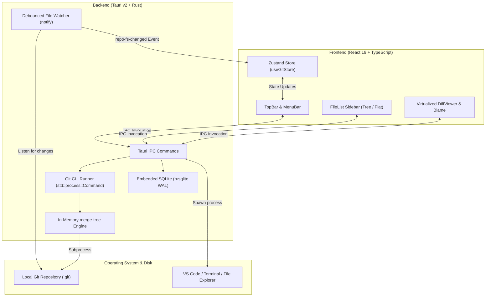

<div align="center">

  

  # Stage0

  **High-Performance Local-First Virtual MR / PR Sandbox**

  *Simulate 3-dot branch comparisons and predict merge conflicts in memory with zero disk modifications.*

  [](./LICENSE)
  [](https://tauri.app/)
  [](https://react.dev/)
  [](https://www.rust-lang.org/)
  [](https://www.typescriptlang.org/)
  [](https://tailwindcss.com/)

</div>

---

## 📖 Overview

**Stage0** is a desktop application built for developers who need to review merge requests, inspect virtual branch differences, and identify merge conflicts **before** pushing to remote servers (GitHub, GitLab, Bitbucket) or altering local working branches.

By leveraging low-level Git commands like `git merge-tree --write-tree` and safe subprocess streaming in Rust, Stage0 predicts conflicts and computes 3-dot diffs completely in memory without touching your `.git/index` or dirtying your uncommitted changes.

---

## ✨ Features

- **🛡️ Zero-Risk Merge Sandbox**:
  - In-memory conflict detection via `git merge-tree` with exact conflicting file isolation.
  - Test merges and rebases safely before committing or pushing.
- **⚡ 3-Dot Comparison (`base...compare`)**:
  - Accurately computes merge-base commits and changed files with addition/deletion statistics (`numstat`).
  - Single-click **Swap Base & Compare** to reverse perspective instantly.
- **🔍 Virtualized Diff Engine**:
  - Powered by `@git-diff-view/react` for buttery-smooth virtual scrolling over thousands of lines.
  - Side-by-side (Split) and Inline (Unified) diff layouts with keyboard shortcuts.
- **📜 Deep Blame Inspector & Inline Blame**:
  - Dedicated **File Blame** view showing commit hashes, authors, commit dates, and commit messages.
  - **Inline Git Blame** (VS Code style) that displays the author and commit context right on the active diff line.
- **🔄 Realtime File & Git Watcher**:
  - Multi-threaded debounced watcher (via Rust `notify`) detects disk changes and branch switches automatically.
  - Preserves view state, selected files, and scroll positions across updates.
- **🛠️ Direct Toolchain Integration**:
  - Open current repository or files directly in your system's default terminal, Visual Studio Code, or native file manager (**File Explorer** on Windows, **Finder** on macOS, **File Manager** on Linux).
  - Quick copy commands for relative path, absolute path, and remote web URL (`github.com/.../blob/...`).
- **🎨 Sleek Monochromatic UI**:
  - Curated Catppuccin-inspired dark and light palettes.
  - Customizable typography (Fira Code, JetBrains Mono, Cascadia Code, SF Mono, etc.) with ligature toggle.
- **🔒 100% Local & Private**:
  - Built-in embedded SQLite (`rusqlite` with WAL mode) for persisting recent repositories and review sessions.
  - Zero external telemetry, no required cloud accounts.

---

## 🏗️ Architecture



---

## 🚀 Getting Started

### Prerequisites

Ensure you have the following installed on your machine:
- **Git CLI** (v2.38+ recommended for `git merge-tree --write-tree` support).
- **Node.js** (v18.0.0 or higher) and `npm`.
- **Rust Toolchain** (latest stable version):
  ```bash
  curl --proto '=https' --tlsv1.2 -sSf https://sh.rustup.rs | sh
  ```
- **OS Build Essentials**:
  - **Windows**: Microsoft C++ Build Tools (via Visual Studio Installer).
  - **macOS**: Xcode Command Line Tools (`xcode-select --install`).
  - **Linux (Ubuntu/Debian)**:
    ```bash
    sudo apt update && sudo apt install libwebkit2gtk-4.1-dev build-essential curl wget file libssl-dev libayatana-appindicator3-dev librsvg2-dev
    ```

### Installation & Local Development

1. **Clone the repository:**
   ```bash
   git clone https://github.com/anhquoctran/stage0.git
   cd stage0
   ```

2. **Install frontend dependencies:**
   ```bash
   npm install
   ```

3. **Run the development application:**
   ```bash
   npm run dev:app
   ```
   *This starts the Vite local server and compiles the Tauri native window with live hot-reloading.*

4. **Verify TypeScript & Rust types:**
   ```bash
   npm run typecheck
   cd backend && cargo check
   ```

### Building for Production

To create a production-ready desktop installer/executable:
```bash
npm run build:app
```
Artifacts will be packaged in `backend/target/release/bundle/`.

---

## ⌨️ Keyboard Shortcuts

| Shortcut | Action | Scope |
| :--- | :--- | :--- |
| <kbd>Ctrl</kbd> + <kbd>O</kbd> | Open repository folder dialog | Global |
| <kbd>Ctrl</kbd> + <kbd>R</kbd> | Refresh virtual diff & re-check conflicts | Global |
| <kbd>Ctrl</kbd> + <kbd>Shift</kbd> + <kbd>T</kbd> | Open Preferences dialog | Global |
| <kbd>Ctrl</kbd> + <kbd>Shift</kbd> + <kbd>F</kbd> | Fetch all remotes and prune | Repository |
| <kbd>Ctrl</kbd> + <kbd>Shift</kbd> + <kbd>P</kbd> | Quick Pull from default remote branch | Repository |
| <kbd>Ctrl</kbd> + <kbd>Alt</kbd> + <kbd>P</kbd> | Pull from... (advanced options modal) | Repository |
| <kbd>Ctrl</kbd> + <kbd>Shift</kbd> + <kbd>R</kbd> | Quick Rebase onto compare branch | Repository |
| <kbd>Ctrl</kbd> + <kbd>Alt</kbd> + <kbd>R</kbd> | Rebase from... (advanced options modal) | Repository |
| <kbd>Alt</kbd> + <kbd>Shift</kbd> + <kbd>T</kbd> | Open repository in default terminal | Global |
| <kbd>Alt</kbd> + <kbd>Shift</kbd> + <kbd>V</kbd> | Open repository in Visual Studio Code | Global |
| <kbd>Alt</kbd> + <kbd>Shift</kbd> + <kbd>E</kbd> | Open repository in File Explorer / Finder | Global |
| <kbd>Shift</kbd> + <kbd>Alt</kbd> + <kbd>R</kbd> | Reveal selected file in native file manager | Selected File |
| <kbd>Ctrl</kbd> + <kbd>Shift</kbd> + <kbd>C</kbd> | Copy relative file path | Selected File |
| <kbd>Shift</kbd> + <kbd>Alt</kbd> + <kbd>C</kbd> | Copy absolute file path | Selected File |
| <kbd>Ctrl</kbd> + <kbd>Shift</kbd> + <kbd>U</kbd> | Copy remote web file URL | Selected File |
| <kbd>Alt</kbd> + <kbd>B</kbd> | Toggle file Git Blame view | Active File |
| <kbd>Alt</kbd> + <kbd>Shift</kbd> + <kbd>B</kbd> | Toggle inline Git Blame annotations | Diff View |
| <kbd>S</kbd> | Switch to side-by-side (split) diff view | Diff View |
| <kbd>U</kbd> | Switch to inline (unified) diff view | Diff View |
| <kbd>↓</kbd> / <kbd>J</kbd> | Navigate to next modified file | File List |
| <kbd>↑</kbd> / <kbd>K</kbd> | Navigate to previous modified file | File List |

---

## 🤝 Contributing

We welcome contributions from the open-source community! Whether fixing bugs, improving docs, or proposing new features, please read our [CONTRIBUTING.md](./CONTRIBUTING.md) and adhere to our [CODE_OF_CONDUCT.md](./CODE_OF_CONDUCT.md).

---

## 🔒 Security

For security vulnerability disclosures, please review our [SECURITY.md](./SECURITY.md).

---

## 📄 License

Stage0 is open-source software licensed under the [MIT License](./LICENSE).
